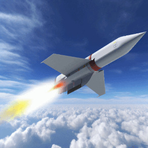

# UAP Tracking with YOLO v5 and Faster R-CNN using Radar Data

This repository contains the code and design documents for the research project titled "Comparing YOLO v5 and Faster R-CNN for Unidentified Aerial Phenomena (UAP) Tracking using Radar Data".

## Background

The tracking of Unidentified Aerial Phenomena (UAP) is a critical challenge for military and aviation authorities, as these objects have erratic flight paths, high speed, and move unpredictably. Machine learning algorithms have shown promise in tracking these objects, but there is a need to determine which architecture is the most effective for the task. This research proposal aims to compare the performance of two popular machine learning architectures, YOLO v5 and Faster R-CNN, for UAP tracking using radar data.

## Research Question

Which machine learning architecture, YOLO v5 or Faster R-CNN, is more effective for UAP tracking using radar data?

## Methodology

The proposed methodology will involve the following steps:

1. Collection of radar data for UAP trajectories.
2. Preprocessing of the radar data to extract the relevant features and labels for the machine learning models.
3. Training and fine-tuning of the YOLO v5 and Faster R-CNN architectures using the radar data.
4. Comparison of the performance of the two architectures in terms of accuracy, precision, recall, and F1-score.
5. Analysis of the results to determine which architecture is more effective for UAP tracking using radar data.

## Expected Results

It is expected that the results of this research will provide insights into the performance of YOLO v5 and Faster R-CNN architectures for UAP tracking using radar data. This will enable the military and aviation authorities to select the most suitable architecture for the task, ensuring accurate tracking and prediction of UAP trajectories.

## Repository Contents

The repository contains the following files and folders:

- `data/`: This folder contains the radar data collected for UAP trajectories.
- `code/`: This folder contains the Python code for preprocessing the data, training and fine-tuning the YOLO v5 and Faster R-CNN architectures, and evaluating their performance.
- `docs/`: This folder contains the design documents and reports for the research project.
- `README.md`: This file, which provides an overview of the repository and the research project.

## Conclusion

The proposed research will contribute to the advancement of machine learning algorithms for UAP tracking and enhance the military and aviation authorities' capability to detect and identify these objects, ensuring safety and security in airspaces.
